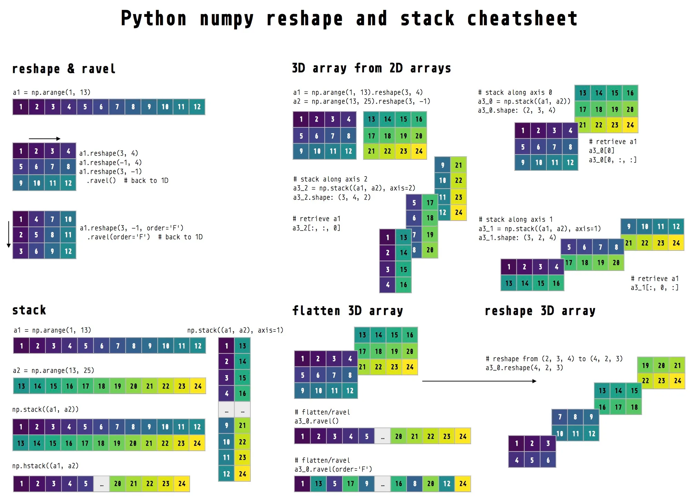

# My note

## Data process

使用了pandas来读取csv文件，不过该数据集是tsv文件，一样可以用。使用`read_csv()`会返回一个叫dataframe类型的值，这个值是可以直接使用列名来取出数据的，非常实用。

遇到的一个问题是，总是找不到数据文件在哪，后来发现是working directory不正确。虽然脚本路径是当前文件的位置，但是运行代码时使用的是working directory，一般来说是项目的根目录。

### Functions

- `read_data()` 读取csv数据并返回Dataframe

## Feature extraction

复习了bag of word和n-grams模型，bow模型其实就是1-gram模型。这两个class都有`fit`和`transform`函数，作用分别是读取文档并识别出所有的词，以及计算出这些词的频率矩阵。

遇到的一个小问题是，把默认运行的代码放在class里了，导致一直说NGrams未定义，下次要注意。

### Functions

Bag of words模型，N-grams模型：

- `fit()` 读取文档并把每个词或每两个词放入dict中
- `transform()` 读一遍文档并统计每个词/每两个词的出现频率 做成矩阵
- `fit_transform()` 上面两个方法结合

## Softmax regression

batch更新方式就是一次性计算所有数据点，一次性更新所有权重。而stochastic就是每次随机抽一个index出来更新。整体的计算只要仔细看下来还是可以看懂的。要注意的就是维度的变化和计算，确实有点绕有点复杂，但不是困难。

### Functions

- `fit()` 设置超参数，把`y`转换为独热编码，正式训练，计算loss，展示图片
- `predict()` 输入一批`X`并给出预测的`y`
- `score()` 使用`predict()`函数并计算一批`X`和`y`的准确率

遇到了很多方法上的问题，这里给自己解答一下。

---

**问题1：**`prob = np.dot(self.weight, Xi.T)`和`Xi.dot(self.weight.T)`有什么区别？左边的为什么会让我的训练loss全为0？

**回答1：**`prob = np.dot(self.weight, Xi.T)`中，`self.weight`形状为`(num_classes, m)`，行是类别数量，列是特征数量。`Xi`的形状为`(1, m)`，即单个样本的特征向量。他们计算结果的形状为`(num_classes, 1)`。这种写法可能存在的问题是，在Softmax函数中，我需要的概率分布应该是1D向量，形状为`(num_classes,)`。但这里`prob`是一个列向量，形状为`(num_classes, 1)`，直接传入给Softmax函数可能会导致形状不匹配或计算错误。

> 这个回答1讲了很多，但经过我的测试，实际上就是一个形状不匹配。如果`self.weight`在左边的写法中在左边，那么在右边的写法中，也必须由它来调用这个`dot`函数，才能让这两个写法得到的结果相同。

**问题2：**`reshape(-1)`和`flatten()`到底是什么区别？`reshape()`还可以怎么使用？

**回答2：**首先，reshape(-1)和flatten都能把数组展平，也就是把多为数组转成一维数组，在这方面两者效果是相同的。他们的关键区别在于，`flatten()`不会修改原数组（因此需要一个变量来接收），而`reshape(-1)`会修改原数组，这一规则也符合`reshape()`使用其他参数。假设`reshaped = arr.reshape(-1)`，并且`reshaped[0] = 10`，那么不仅`arr[10]`变成了`10`，`reshaped[0]`也变成了`10`。至于这个`-1`，可以理解为默认或者自动推导。如果`arr`是一个`(4, 8)`的矩阵，调用`arr.reshape(2, -1)`，则会自动让它变成`(2, 16)`的矩阵。这个`-1`也可以在行参数那里，那定好列参数就会自动推导行参数。图片里有更多的相关用法。



---

**问题3：**为什么batch不需要使用`flatten()`？为什么stochastic就需要？

**回答3：**这是个简单的形状问题。batch中prob的形状是`X`和`self.weight.T`的点乘，分别是`(n, m)`和`(m, num_classes)`，因此`prob`的形状是`(n, num_classes)`。通过使用`prob[i]`，形状为`(1, num_classes)`，就能得到每一条数据被预测为每一个class的概率。接下来还使用了`y[i]`来取得符合label的概率（单点数据），因此不太需要使用`flatten()`。而stochastic不太一样，`Xi`形状为`(1, m)`，`self.weight.T`形状仍是`(m, num_classes)`，这里得到的`prob`形状是`(1, num_classes)`，也就是`(1, 5)`。但这仍然是一个矩阵而不是一个一维数组，所以我们要使用`flatten()`或`reshape(-1)`或`reshape(-1,)`或`reshape(num_classes,)`，使它变成一维数组才可以被下面拿来计算。

```
arr = np.array([[1, 2, 3], [2, 3, 4], [3, 4, 5], [4, 5, 6]]) # 4x3
flatten -> [1, 2, 3, 2, 3, 4, 3, 4, 5, 4, 5, 6]
reshape(-1) - > [1, 2, 3, 2, 3, 4, 3, 4, 5, 4, 5, 6]
# 下面这个reshape不是一维向量 它仍是一个矩阵
reshape(1, -1) -> [[1, 2, 3, 2, 3, 4, 3, 4, 5, 4, 5, 6]] 
```

## Main

这里并不复杂，分割数据集，初始化模型，调用训练函数。值得一提的是，`sklearn.model_selection`里面有一个`train_test_split()`函数还挺好用的。输入的参数有整个数据集，测试集的尺寸（小于1则是比例，大于则是数量），随机数，以及`stratify`。通过设置 `stratify=y`，可以确保划分后的训练集和测试集中，每个类别的比例与原始数据一致。也就是说，按照 `y` 的类别分布进行分层采样，确保训练集和测试集中各类别的比例与 `y` 一致。
